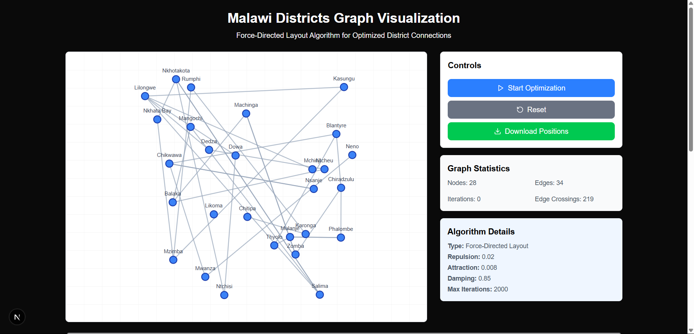

# Malawi Districts Graph Visualization

Force-directed layout optimization for Malawi's 28 districts.

## Dependencies
{
 "dependencies": {
    "lucide-react": "^0.525.0",
    "next": "15.3.5",
    "react": "^19.0.0",
    "react-dom": "^19.0.0"
  }, 
}

## Setup

First, Navigate to project folder:
```bash
cd malawi-districts-graph-visualization
```

Then, Install dependencies:
```bash
npm install
```

Lastly, Run the development server:
```bash
npm run dev
# or
yarn dev
# or
pnpm dev
# or
bun dev
```

Open [http://localhost:3000](http://localhost:3000) with your browser to see the result.




